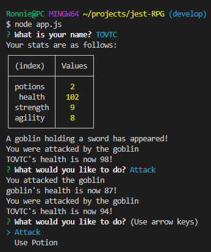

  # Jest RPG
  This application runs an RPG game from the command line using Node.js. This application was built using Jest Test-Driven Development and Object Oriented Programming.
  
  ## Table of Contents
  * [Installation](#installation)
  * [Built With](#built)
  * [Usage Information](#usage)
  * [Authors & Acknowledgements](#credits)
  * [Tests](#tests)
  * [Contact](#questions)

  ## Built With 
  * Node.js
  * Jest
  * JavaScript
  
  ## Installation 
  After cloning the repository and ensuring Node.js is installed, type "node app.js" in the terminal to begin the game.
  
  ## Usage Information
    
    
  ## Authors & Acknowledgements
  © 2020 - 2022 Trilogy Education Services, a 2U, Inc. brand. All Rights Reserved. 
  Made by [TOVTC](https://github.com/TOVTC).
  
  ## Tests
  This application employed Jest Test-Driven Development to test all objects and methods.
    
  ## Questions?
  Contact repository author via [GitHub](https://github.com/TOVTC). 
    
  
  